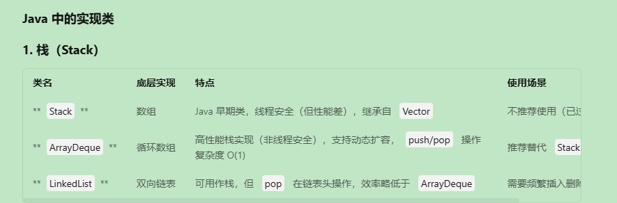

# 栈与队列

## 栈

## 队列

哈哈哈哈

**哈哈哈哈**

~~打喳喳~~

[百度](www.baidu.com)

`dsasavvv`

        Stack<Integer> aaa = new Stack<>();
        ArrayDeque<Integer> bbb = new ArrayDeque<>();
        LinkedList<Integer> ccc = new LinkedList<>();//共有的方法有 push pop peek
        LinkedList<Integer> a = new LinkedList<>();
        ArrayDeque<Integer> b = new ArrayDeque<>();
111

    csdvsdv
    擦擦擦·
